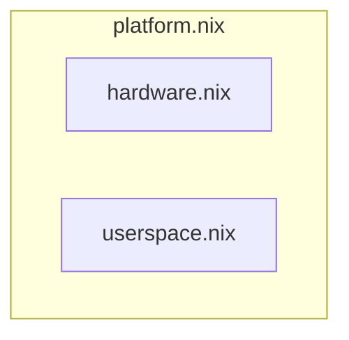
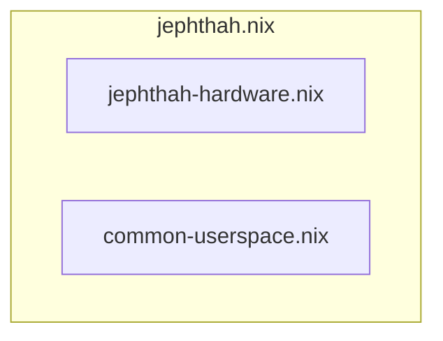

# nixos-config

My [`nixos`](https://nixos.org) configurations.

## organization

I organized the NixOS configurations using the following principle:

> A `platform` configuration is composed of a `userspace` configuration and a `hardware` configuration.

The following diagram illustrates this principle:



The `userspace` configurations, define all the applications and utilities that I am using.
The `hardware` configurations, define all the hardware feature enabled for that particular hardware.

This scheme will allow me to reuse `userspace` configuration with different `hardware`, thus facilitating
the creation of `platforms` for specific purposes.

> [!NOTE]
> At the moment, I have only a single userspace configuration since the purpose of those platforms is for development only.
> Future userspace configurations are expected.


## example

An example with the [`jephthah`](platform/jephthah.nix) platform:



This is done in the `jephthah.nix` using the import directives:
```nix
  imports =
    [ # Include the results of the hardware scan.
      ./hardware-configuration.nix
      # specific hardware configuration
      ./jephthah-hardware.nix
      # personal configurations
      ./common-userspace.nix
    ];
```
